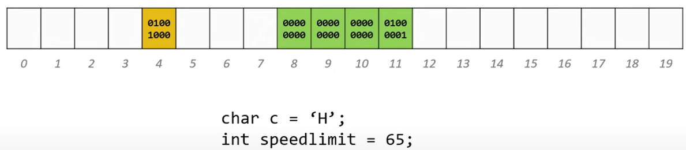
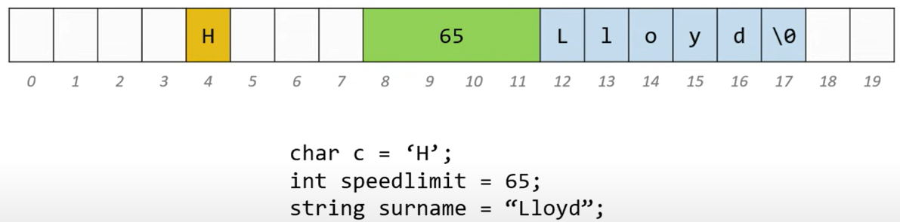
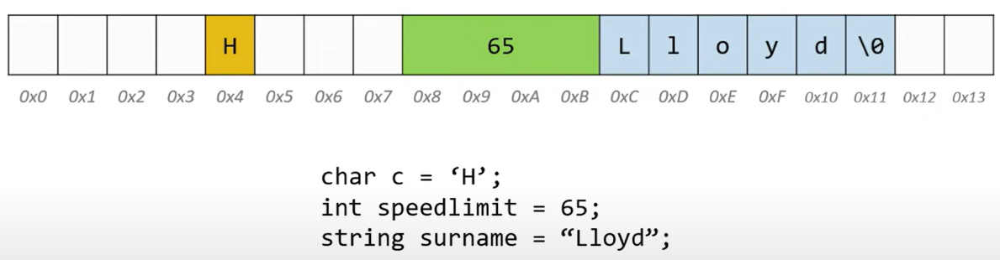

# Asignación de memoria dinámica
## Asignar memoria
Hay dos formas en que se asigna memoria para el almacenamiento de datos:
1. Asignación de tiempo de compilación (o estática) 
   * La memoria para las variables con nombre la asigna el compilador.
   * El tamaño exacto y el tipo de almacenamiento deben conocerse en el momento de la compilación.
   * Es por ello que, cuando declaramos arreglos estándar, el tamaño debe ser constante.

2. Asignación de memoria dinámica
   * Memoria asignada "sobre la marcha" durante el tiempo de ejecución
   * Espacio asignado dinámicamente generalmente ubicado en un segmento de programa conocido como **heap** (montón) o **free store** (almacén gratuito).
   * El compilador no necesita conocer de antemano la cantidad exacta de espacio o el número de elementos.
   * Para la asignación de memoria dinámica, **los punteros son cruciales.**

## Punteros (resumen)
* Los **punteros son direcciones** de las ubicaciones en memoria donde viven las variables. Podemos interpretarlo en términos de cajas 
```cpp
int k; // caja llamada k
k = 5 //  ponemos 5 en la caja
int *pk; // caja llamada pk
pk = &k; // ponemos la direccion de k  |0x123434|
// En  lugar de la direccion la representamos  con una flecha.
//pk  nos da la infomación que necesitamos para encontrar k en memoria
```  
## Memoria
* Cada archivo en un pc vive en su unidad de disco (HDD o SSD)

* Las unidades de disco son un espacio de almacenamiento, no podemos trabajar directamente ahí. La manipulación y el uso de datos solo puede hacerse en en la RAM (Random Acces Memory).

* La memoria es básicamente un gran arreglo de 8 bytes de ancho.
    512 Mb, 1Gb, 2Gb, 4Gb,..

    

    

    

| Tipo de Datos |tamaño(bytes)|
|---------------|-------------|
| int           |  4          |
|   char        | 1           | 
| float         | 4           |
|double         |  8          | 
|long long      |  8          |
| string        |  ???        |
| char* int*    |   ???       |
|float* double* |    ???      |

* Podemos pensar en string como un alias para char*, su tamaño dependerá del compilador y el SO.

## Asignación de memoria dinámica
* Podemos asignar dinámicamente espacio de almacenamiento mientras el programa se está ejecutando, pero no podemos crear nuevos nombres de variables "sobre la marcha".

* Por este motivo, la asignación dinámica requiere dos pasos:

    1. Creando el espacio dinámico
    2. Almacenar su dirección en un puntero (para que se pueda acceder al espacio)
* Para **asignar memoria dinámicamente** en C++, usamos el  operador ``new``.

* **Desasignación**:
  * La desasignación es la "limpieza" del espacio que se utiliza para variables u otro almacenamiento de datos.
  * Las variables en tiempo de compilación se desasignan automáticamente en función de su extensión conocida (esto es lo mismo que el alcance para las variables "automáticas")
  * Es trabajo del programador desasignar el espacio creado dinámicamente.
  * Para **desasignar memoria dinámica**, utilizamos el operador  ``delete``.

### Asignar espacio con ``new``
* Para asignar espacio dinámicamente, utilice el operador unario ``new``, seguido del tipo que se asigna.
  ```cpp
  new int; // asigna dinámicamente un int
  new double; // asigna dinámicamente un double
  ```
* Para crear un arreglo dinámicamente, se usa la misma sintaxis, pero se coloca corchetes con un tamaño después del tipo.

  ```cpp
  new int[40]; // asigna dinámicamente un arreglo de 40 entradas 
  new double[tam]; // asigna dinámicamente un arreglo de doubles de tamaño tam
  // tenga en cuenta que el tamaño puede ser una variable
  ```

* Estas declaraciones anteriores no son muy útiles por sí solas, ¡porque los espacios asignados no tienen nombre! PERO, el  operador ``new`` devuelve la dirección inicial del espacio asignado, y esta dirección se puede almacenar en un puntero:

  ```C++
  int*p; // declarar un puntero p
  p = new int; // asigna dinámicamente un int y carga la dirección en p
  double *d; // declaramos un puntero d
  d = new double; // asigna dinámicamente una dirección doble y carga en d

  // también podemos hacer esto en declaraciones de una sola línea
  int x = 40;
  int * lista = new int[x];
  float * numeros = new float[x+10];
  ```
  Observe que esta es una forma más de inicializar un puntero (y la más importante).

### Acceder al espacio creado dinámicamente
* Una vez que el espacio se ha asignado dinámicamente, ¿cómo lo utilizamos?

* **Para elementos individuales**, pasamos por el puntero. Elimine la referencia del puntero (desreferenciar) para alcanzar el objeto creado dinámicamente:
  ```cpp
  int * p = new int; // entero dinámico, señalado por p
  *p = 10; // asigna 10 al entero dinámico
  cout << *p; // imprime 10
  ```
* **Para arreglos creados dinámicamente**, tenemos 2 alternativas: 
    1. Puede usar notación de desplazamiento (aritmética) de puntero  o 
    
    2. tratar el puntero como el nombre de un arreglo y usar la notación de corchetes estándar:
  ```cpp
  int tam = 7;
  double * listaNum = new double[tam]; // arreglo dinámico

  for (int i = 0; i < tam; i++)
      listaNum[i] = 0; // inicializa los elementos del arreglo a 0

  // notación entre corchetes
  listaNum[5] = 20; 

  // notación de desplazamiento de puntero
  *(listaNum + 7) = 15; // significa lo mismo que listaNum[7]
  ```

### Desasignación de memoria dinámica con ``delete``
* Para desasignar memoria creada con ``new`` , utilizamos el operador unario ``delete`` . **El único operando debe ser un puntero** que almacene la dirección del espacio que se va a desasignar:
  ```cpp
  int * ptr = new int; // int creado dinámicamente
  //...
  delete ptr; // elimina el espacio al que apunta ptr
  ```
  **Tenga en cuenta que el puntero ptr todavía existe** en este ejemplo. Se trata de una variable con nombre sujeta a un alcance y una extensión determinados en el momento de la compilación. ****Se puede reutilizar**:
  ```cpp
  ptr = new int[10]; // apunta p a un nuevo arreglo
  ```

* **Para desasignar una matriz dinámica**, utilice la siguiente sintaxis:
  ```cpp
  delete [] nombre_del_puntero;
  ```
  Ejemplo:
  ```cpp
  int * lista = new int[40]; // arreglo dinámico
  //...
  delete [] lista; // desasigna el arreglo
  lista = 0; // restablecer la lista al puntero nulo
  ```
  Después de desasignar espacio, siempre es una buena práctica, restablecer el puntero a nulo a menos que esté apuntando a otro objetivo válido de inmediato.
 
  **¿qué sucede si no desasigna (libera) la memoria dinámica cuando haya terminado?** 

  Es importante liberar la memoria dinámica cuando ya no la necesitas porque, de lo contrario, puede experimentar problemas de pérdida de memoria (memory leaks), lo que puede conllevar a un consumo excesivo de memoria, provocando un mal funcionamiento del programa.
    
  Algunos problemas que pueden surgir si no se libera la memoria dinámica adecuadamente incluyen:
  
  1. **Fugas de memoria**: (memory leaks) La cantidad de memoria queda reservada y ya no está disponible para otros usos, incluso después de que la variable que la referenciaba ya no es accesible.

      Ejemplos:
      ```cpp
      int* ptr1 = new int; // Reservamos memoria dinámicamente

      *ptr1 = 10; // Asignamos un valor
      
      ptr1 = new int; // Se sobrescribe el puntero, se pierde la referencia (direccion) al bloque de memoria anterior

      *ptr1 = 20; // Asignamos un nuevo valor al nuevo bloque de memoria
      
      delete ptr1; // SOLO liberamos el último bloque de memoria asignado
      ```

      ```cpp
      while (true) {
        int* arr = new int[1000]; // Reservamos memoria dinámicamente en cada iteración
        //... No liberamos la memoria dinámica asignada
      } 
      ```
  2. **Fragmentación de la memoria**: (memory fragmentation) Si reservas y liberas memoria dinámicamente de forma irregular, es posible que se produzca fragmentación de la memoria, lo que puede dificultar la asignación de bloques de memoria contiguos para futuras solicitudes de memoria dinámica. Esto puede reducir la eficiencia y el rendimiento del programa.

      Ejemplo
      ```cpp
      int* arr1 = new int[1000000]; // Reservamos memoria dinámicamente para arr1
      // No Liberamos la memoria
      
      int* arr2 = new int[1000]; // Reservamos memoria dinámicamente para arr2
      // No liberamos la memoria 

      int* arr3 = new int[1000000]; // Intentamos reservar memoria para otro arreglo arr3
      //Esto puede provocar fragmentación de la memoria, ya que la falta de espacio libre dificulta la asignación de bloques de memoria contiguos para futuras solicitudes de memoria dinámica tornando la implementación ineficiente.
      ```
  
  3. **Comportamiento indefinido**: (undefined behavior) En algunos casos, si intentas acceder a memoria que ya ha sido liberada, puedes experimentar un comportamiento indefinido, lo que significa que el comportamiento del programa puede ser impredecible y no está definido por el estándar del lenguaje.

      Ejemplo
      ```cpp
      int* ptr = new int; // Reservamos memoria dinámicamente para un entero

      delete ptr; // Liberamos la memoria
      
      
      cout << *ptr << endl; // Intento de acceder a la memoria liberada puede generar un comportamiento indefinido
      ```

## Ejemplo de aplicación: cambiar el tamaño de un arreglo dinámicamente

Si tenemos un arreglo y tenemos la necesidad de aumentar su tamaño, no es posible simplemente agregar nuevas celdas a las antiguas. Los arreglos se almacenan en memoria consecutiva y nunca se sabe si la memoria inmediatamente después de la matriz ya está asignada para otra cosa. Por esa razón, elproceso requiere de algunos pasos más. A continuación se muestra un ejemplo que utiliza un arreglo de números enteros. 
Dado el arreglo original: 
  ```cpp
  int *lista = new int[tam]; 
  ```

Queremos cambiar el tamaño para que el arreglo lista tenga espacio para 10 números más (asumiendo que el anterior se llenó). Hay cuatro pasos principales que debemos seguir:


1. Cree un arreglo nuevo del tipo apropiado y con el nuevo tamaño. (Necesitará usar asignación dinámica).
    ```cpp
    int * temp = new int[tam + 10];
    ```
 
2. Copie los datos del arreglo anterior al nuevo arreglo (manteniéndolos en las mismas posiciones).
    ```cpp
    for (int i = 0; i < tam; i++)
      temp[i] = lista[i];
    ```

3. Elimine el arreglo anterior: ¡ya no la necesita! (¡Haz lo que dice tu mamá y saca la basura!)

   ```cpp
    delete [] lista; // esto elimina el arreglo apuntado por "lista"
    ```
  
4. Cambia el puntero. Si aún desea que el arreglo se llame "lista" (su nombre original), cambie el puntero de la lista a la nueva dirección.
    ```cpp
    lista = temp;
    ```

  Si deseamos disminuir el tamaño de un arreglo?


